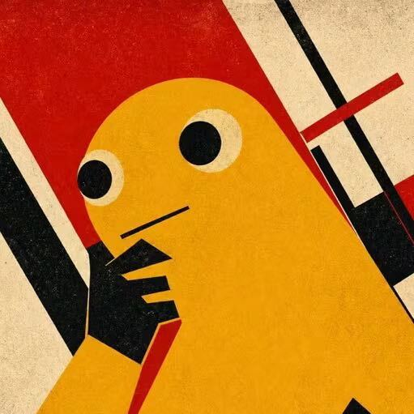

# Hi, I'm Terence 👋

Interested in AI agent, AI infra, Kaggle, turning ideas into useful products.

 

<code>AI Agent</code>&nbsp;&nbsp;<code>AI Infra</code>&nbsp;&nbsp;<code>Kaggle</code>&nbsp;&nbsp;<code>Useful Products</code>

  

<table>
  <tr>
    <td width="64%" valign="top">
      <h3 align="left">🎯 What's Next</h3>
      

        <strong>🥈 Kaggle Silver</strong> 
        Work toward earning a Kaggle silver medal.
      

      

        <strong>🧠 Build &amp; Reproduce</strong> 
        Rebuild an LLM with Stanford CS336 and reproduce Moonshot AI's <em>Attention Residuals</em>.
      

      

        <strong>📚 Fall 2026</strong> 
        Survive in this semester.
      

      

        <strong>💼 Internship Prep</strong> 
        Practice LeetCode, review LLM fundamentals, and actively pursue internships.
      

    </td>
    <td width="36%" align="center" valign="middle">
      
    </td>
  </tr>
</table>

 

## Contribution Snake

<picture>
  <source media="(prefers-color-scheme: dark)" srcset="https://raw.githubusercontent.com/Terence0914/Terence/output/github-contribution-grid-snake-dark.svg">
  <source media="(prefers-color-scheme: light)" srcset="https://raw.githubusercontent.com/Terence0914/Terence/output/github-contribution-grid-snake.svg">
  
</picture>
